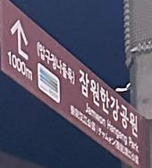

# __CTF COMPFEST 15__ 
## _Not A CIA Test_

## Information
**Category:** | **Points:** | **Writeup Author**
--- | --- | ---
OSINT | 100 | themanusia

**Description:** 

> That night was definitely the happiest of my life. I get to spend a night with my favorite girl, walking and strolling around the streets of Seoul, holding hands and enjoying the winter air with the beautiful night lights decorating our surroundings. Look, I even took a picture of her! Although, she was really camera-shy. What I don’t really get is, my friends told me that all of this is just in my imaginations. I can assure you I did have a date with her. Otherwise, how would I take this picture?!
> 
> Anyway, I organize my dating pictures by location. The problem is, I forgot the name of the street where I took this picture, specifically the street behind her. And the girl? Well, long story, but there’s no way I can ask her. All I can remember is this location was near a Burberry store. I tried to look it up too, but the streets and buildings were pretty hard to recognize because the pictures on the internet were from 5 years ago.
> 
> I know you can find the street location. So please help me, yeah? Also, sorry for the pixellated image!
> 
> NOTE: Brute-force solutions in the writeups will not be considered valid.
> 
> Flag format: COMPFEST15{StreetNameWithoutDash_DistrictName_BurberryStorePlusCode}
> 
> Example: COMPFEST15{BanpoDaero_Geumjeong_RRXH+88}
>
> [ayang.jpg](ayang.jpg)

## Solution
Diberikan sebuah gambar ~~istri saya~~ seorang perempuan. Kita cari menggunakan reverse image [Yandex](https://yandex.com) dan ditemukan gambar yang mirip dan lebih jelas pada twitter [아이즈원 봇](https://twitter.com/izone_bot/status/1619992647451680768). Pada postingan twitter tersebut jika dizoom pada papan coklat terdapat sebuah hint jika daerah tersebut berada di sekitar `Jamwon Hangang Park`

Lalu pada deskripsi soal terdapat hint `All I can remember is this location was near a Burberry store` jadi kita cari `Burberry store` pada sekitar `Jamwon Hangang Park` di Google Maps dan kita mendapatkan lokasi di [Google Maps](https://goo.gl/maps/L5DbmY1LmMoFcybLA)

## Flag:
> COMPFEST15{DosanDaero_Gangnam_G2FW+QP}