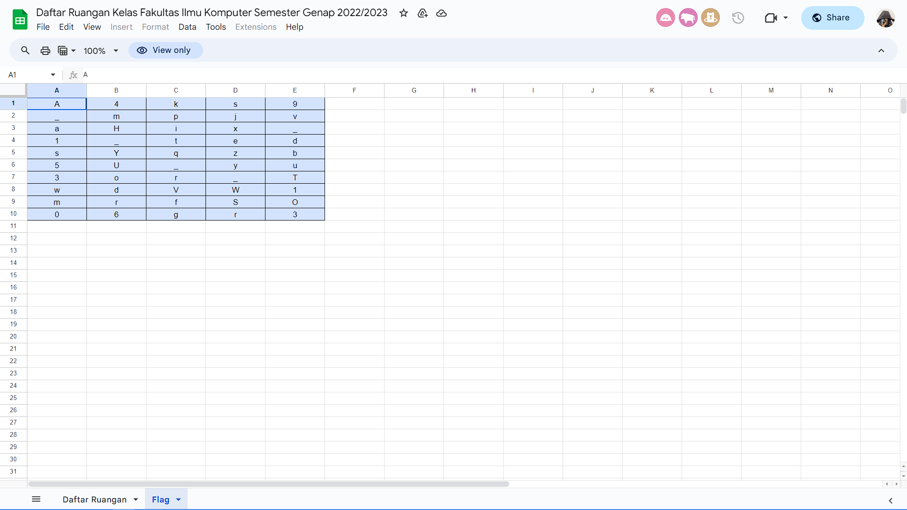

# __CTF COMPFEST 15__ 
## _classroom_

## Information
**Category:** | **Points:** | **Writeup Author**
--- | --- | ---
Misc | 154 | kilometer

**Description:** 

> New semester has begun, this is a class room list for each day : https://bit.ly/spreadsheet-chall Wait.. why there is a flag page?
> 
> Flag : COMPFEST15{flag}

## Solution
Diberikan sebuah spreadsheet yang berisi page Daftar Ruangan dan Flag.

### Daftar Ruangan

### Flag

Terdapat sebuah teks base64 pada cell A1 yang jika didecode menghasilkan `Aku menyembunyikan flagnya di jadwal Hari Selasa karena kukira tidak ada murid yang secerdas itu!`.
Kita buka page flag dan kita cocokkan dengan daftar ruangan pada hari selasa yang akan menghasilkan `v3ry_e4sY`.

## Flag:
> COMPFEST15{v3ry_e4sY}