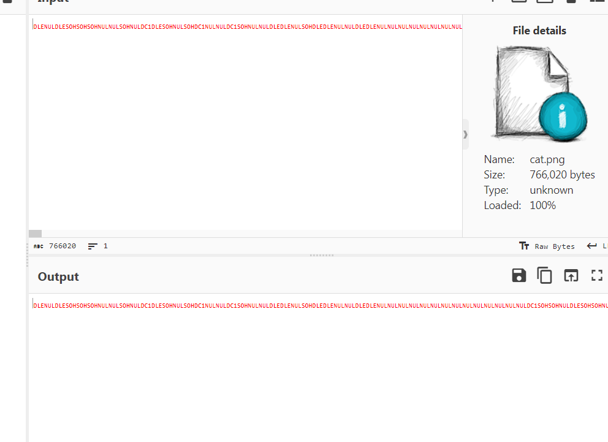
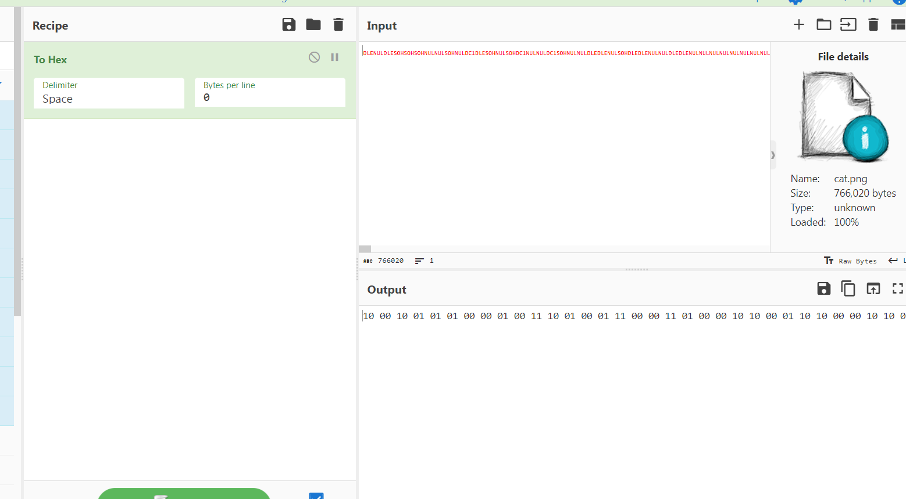
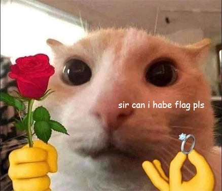
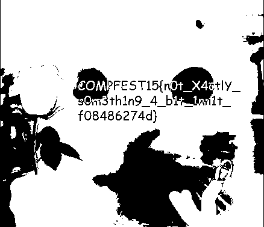

# __CTF COMPFEST 15__ 
## _not simply corrupted_

## Information
**Category:** | **Points:** | **Writeup Author**
--- | --- | ---
Forensics | 316 | notnot

**Description:** 

> My friend loves to send me memes that has cats in it! One day, he sent me another cat meme from his 4-bit computer, this time with “a secret”, he said. Unfortunately, he didn’t know sending the meme from his 4-bit computer sorta altered the image. Can you help me repair the image and find the secret?
>
> [cat.png](cat.png)

## Solution
Diberikan sebuah file [cat.png](cat.png) dan tidak bisa dibuka, sepertinya file ini corrupt. Kita buka menggunakan cyberchef dan terlihat tidak seperti file gambar apa pun.

Kita convert ke hex dan hanya menghasilkan angka 1 dan 0.

Kita ubah delimiter To Hex menjadi none dan kita convert dari binary menghasilkan gambar kucing lucu.

Pada gambar tersebut tidak ada hal yang menarik jika kita menggunakan tools `strings`, `binwalk`, dan lainnya. Jadi kita gunakkan situs [Apperi'Solve](https://www.aperisolve.com/) untuk mendapatkan flag dan kita mendapatkan gambar berikut.

## Flag:
> COMPFEST15{n0t_X4ctlY_s0m3th1n9_4_b1t_1nn1t_f08486274d}